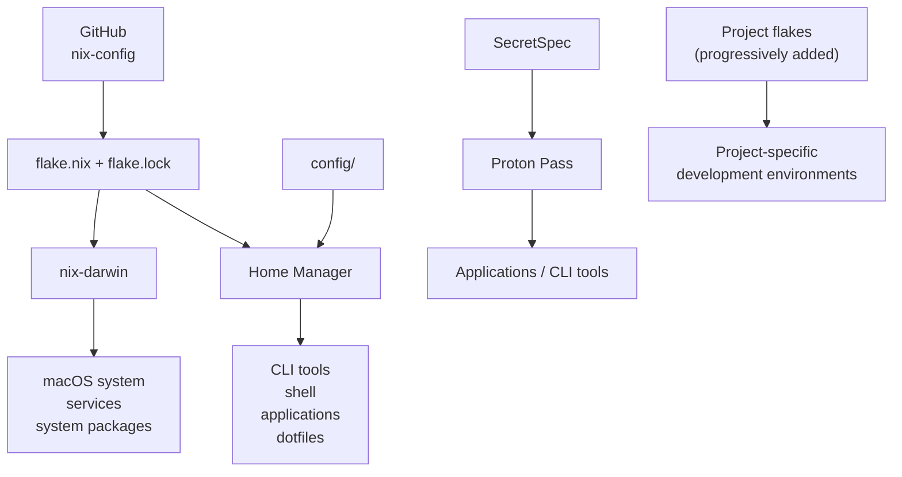
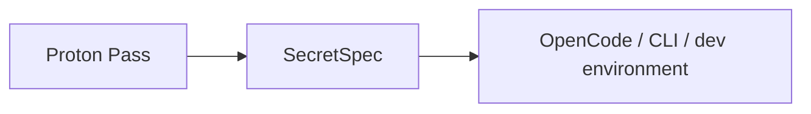

# nix-config

My personal macOS configuration managed with **Nix**, **nix-darwin**, and **Home Manager**.

I'm building this repository while learning Nix step by step.

This is **not** meant to be a perfect or definitive Nix setup. It evolves as I learn new concepts, understand better patterns, break things, fix them, and progressively migrate my development environment to Nix.

I made this repository public mainly to share my setup and learning journey with friends and anyone interested in doing something similar.

Feel free to explore, copy ideas, or suggest improvements.

## Goal

The goal is simple:

> Make my Mac and development environment reproducible, declarative, and versioned in Git.

Instead of manually reinstalling and configuring everything on a new machine, I want most of my environment to be described here.

## Mental model



The important separation is:

```text
macOS / machine configuration
→ nix-darwin

user tools / shell / dotfiles
→ Home Manager

project dependencies
→ project flakes / devShells

user and development secrets
→ SecretSpec + Proton Pass

application runtime data
→ managed by the application
```

Not everything needs to be managed by Nix.

The goal is not "100% Nix".

The goal is to use Nix where it actually makes the environment easier to reproduce and maintain.

---

## Repository structure

```text
.
├── flake.nix
├── flake.lock
├── darwin.nix
├── home.nix
└── config/
    ├── karabiner/
    ├── neru/
    ├── nvim/
    ├── opencode/
    ├── rio/
    ├── secretspec/
    ├── sketchybar/
    └── zed/
```

### `flake.nix`

Entry point of the configuration.

It defines the dependencies of the setup:

- nixpkgs
- nix-darwin
- Home Manager
- other Nix inputs

It also defines the available machines.

My current Mac configuration is:

```text
lvs-mac-cf7426
```

### `flake.lock`

Pins the exact versions of the flake dependencies.

This file is committed to Git.

It is what makes the setup reproducible instead of always pulling random newer versions.

### `darwin.nix`

Machine-level macOS configuration.

Examples:

- system packages
- launchd services
- Tailscale
- SketchyBar
- JankyBorders
- macOS-specific configuration

### `home.nix`

User-level configuration.

Examples:

- CLI tools
- Zsh
- shell aliases
- Home Manager programs
- desktop applications
- user configuration

### `config/`

Configuration files for applications.

For applications I edit frequently, I generally use Home Manager **out-of-store symlinks**.

For example:

```text
~/.config/nvim
        │
        ▼
~/nix-config/config/nvim
```

This means editing:

```bash
nvim ~/.config/nvim/init.lua
```

is directly editing the Git repository.

No Nix rebuild is needed when changing those files.

---

# Install on a new Mac

This configuration is currently built for my own machine and username.

Before blindly applying it on another Mac, check:

```text
username: raphaeldamevin
machine:  lvs-mac-cf7426
platform: aarch64-darwin
```

These values may need to be changed for another machine.

## 1. Install Nix

Install Nix first.

The setup uses modern Nix commands and flakes.

## 2. Clone the repository

```bash
git clone git@github.com:damevin/nix-config.git ~/nix-config
cd ~/nix-config
```

## 3. Check the machine configuration

Available configurations can be inspected with:

```bash
nix flake show
```

The current one is:

```text
lvs-mac-cf7426
```

For another Mac, the corresponding `darwinConfigurations` entry and machine-specific settings should be adapted first.

## 4. Bootstrap nix-darwin

On a fresh Mac, `darwin-rebuild` is not installed yet.

Bootstrap it with:

```bash
sudo nix run nix-darwin/master#darwin-rebuild -- \
  switch --flake .#lvs-mac-cf7426
```

After the first successful activation, `darwin-rebuild` is available normally.

## 5. Rebuild normally

From now on:

```bash
sudo darwin-rebuild switch --flake .#lvs-mac-cf7426
```

That's the main command used to apply the configuration.

Some macOS applications may still require permissions such as:

- Accessibility
- Screen Recording
- Notifications
- Full Disk Access

Nix installs/configures the software, but macOS security permissions still belong to macOS.

---

# Daily commands

## Test changes

Before applying a configuration:

```bash
darwin-rebuild build --flake .#lvs-mac-cf7426
```

This builds the configuration without switching the running system to it.

## Apply changes

```bash
sudo darwin-rebuild switch --flake .#lvs-mac-cf7426
```

This is the command I use most often.

Typical workflow:

```bash
nvim home.nix

darwin-rebuild build --flake .#lvs-mac-cf7426

sudo darwin-rebuild switch --flake .#lvs-mac-cf7426
```

## Update Nix dependencies

```bash
nix flake update
```

Then:

```bash
darwin-rebuild build --flake .#lvs-mac-cf7426
sudo darwin-rebuild switch --flake .#lvs-mac-cf7426
```

If everything works:

```bash
git add flake.lock
git commit -m "chore: update Nix inputs"
```

## Inspect the flake

```bash
nix flake show
```

## Check a package version

For example:

```bash
nix eval --raw \
  '.#darwinConfigurations."lvs-mac-cf7426".pkgs.obsidian.version'
```

## Search for a package

```bash
nix search nixpkgs <package>
```

For example:

```bash
nix search nixpkgs ripgrep
```

## Check Git changes

```bash
git status
```

Because flakes only see files tracked by Git, remember to stage new configuration files:

```bash
git add <file>
```

A commit is not required before rebuilding.

---

# Adding a global package

Global user tools belong in `home.nix`.

For example:

```nix
home.packages = with pkgs; [
  ripgrep
  fd
  bat
];
```

Then:

```bash
sudo darwin-rebuild switch --flake .#lvs-mac-cf7426
```

I try to only put **truly global tools** here.

Project-specific dependencies should not pollute the global machine environment.

---

# Adding a macOS application

Applications available in nixpkgs can also be installed through Home Manager.

For example:

```nix
home.packages = with pkgs; [
  obsidian
  raycast
];
```

Some proprietary applications are marked as `unfree`.

I explicitly allow the ones I want instead of enabling every unfree package globally.

The important distinction is:

```text
Application binary
→ Nix

Account / sessions / database / cache / extensions
→ application
```

For example, Nix installs Obsidian, but my vault and Obsidian runtime data are not stored in Nix.

---

# Dotfiles

Some application configurations are versioned directly in this repository.

Examples include:

```text
Neovim
Rio
SketchyBar
Karabiner
Zed
OpenCode
```

For actively edited configurations I use out-of-store symlinks:

```nix
home.file.".config/nvim".source =
  config.lib.file.mkOutOfStoreSymlink
    "${config.home.homeDirectory}/nix-config/config/nvim";
```

This gives me:

```text
application
    │
    ▼
~/.config/foo
    │
    ▼
~/nix-config/config/foo
    │
    ▼
Git
```

Changes are immediately visible to the application and to Git.

---

# Secrets

Secrets are **never committed to this repository**.

Things that should never be stored here:

```text
API keys
passwords
OAuth tokens
private keys
.env files with credentials
```

For user/development secrets I currently use:



The repository only contains the **definition** of which secrets are required.

For example:

```toml
[profiles.default]

YNAB_API_KEY = {
  description = "YouNeedABudget personal API token",
  required = true,
  providers = ["proton"]
}
```

The actual value is stored in Proton Pass.

---

# Project environments

One of the next steps of this setup is progressively moving project-specific dependencies into their own Nix flakes.

Instead of:

```text
Mac
├── Node globally
├── Ruby globally
├── PostgreSQL libs globally
├── project A dependencies
├── project B dependencies
└── random Homebrew packages
```

The target is:

```text
Mac / Home Manager
├── Neovim
├── Git
├── ripgrep
├── OpenCode
└── other global tools

Project A
└── flake.nix
    ├── Node
    ├── pnpm
    └── native dependencies

Project B
└── flake.nix
    ├── Ruby
    ├── PostgreSQL
    └── native dependencies
```

Then entering a project can eventually be as simple as:

```bash
nix develop
```

This keeps project dependencies isolated from the global machine.

---

# Current philosophy

A few rules I'm trying to follow while learning Nix:

1. **Understand before adding**

   I'm trying not to blindly copy Nix snippets without understanding what they do.

2. **Keep global packages minimal**

   If something only exists because one project needs it, it should eventually live with that project.

3. **Don't force everything into Nix**

   Some macOS applications have complex system integrations and are better left native.

4. **Don't put mutable runtime data in the Nix store**

   Application caches, databases, accounts, generated files, and runtime state should usually stay mutable.

5. **Never put secrets in the Nix store**

   Secrets live outside the configuration and are injected when needed.

6. **Commit `flake.lock`**

   Reproducibility depends on pinning the inputs.

7. **Build before switching**

   When making significant changes:

   ```bash
   darwin-rebuild build --flake .#lvs-mac-cf7426
   ```

   before:

   ```bash
   sudo darwin-rebuild switch --flake .#lvs-mac-cf7426
   ```

---

# Why Nix?

What I'm trying to get away from is this:

```text
"Why does this work on my Mac?"

"I think I installed that with Homebrew six months ago."

"Which version of Node was I using?"

"Where did this config file come from?"

"What do I need to reinstall on a new laptop?"
```

And move toward:

```text
git clone
    ↓
Nix
    ↓
rebuild
    ↓
my environment is back
```

That's the experiment behind this repository.
